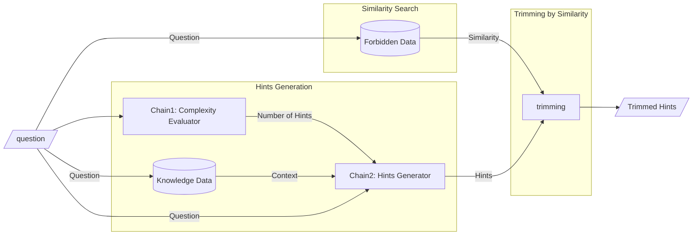

```mermaid
flowchart LR
    subgraph Hints Generation
        direction LR
        chain2[Chain2: Hints Generator]
        chain1[Chain1: Complexity Evaluator] --> |Number of Hints| chain2
        rag1[(Knowledge Data)] --> |Context| chain2
    end
    subgraph Similarity Search
        direction LR
        rag2[(Forbidden Data)]
    end
    subgraph Trimming by Similarity
        rag2 --> |Similarity| trimming
        chain2 --> |Hints| trimming
    end
    input[/question/] -->  chain1
    input --> |Question| chain2
    input --> |Question| rag1
    input --> |Question| rag2
    trimming --> output[/Trimmed Hints/]
```